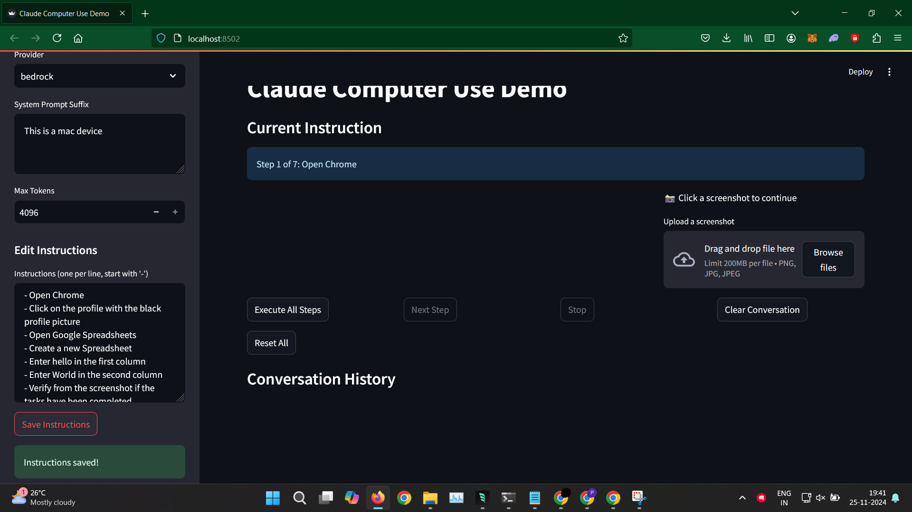
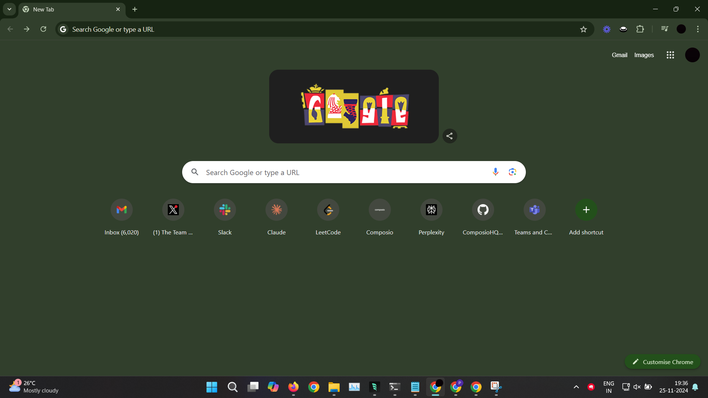
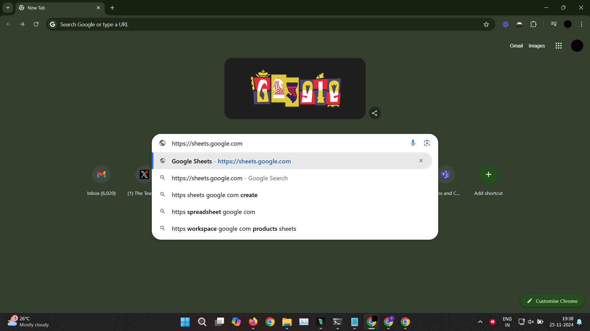
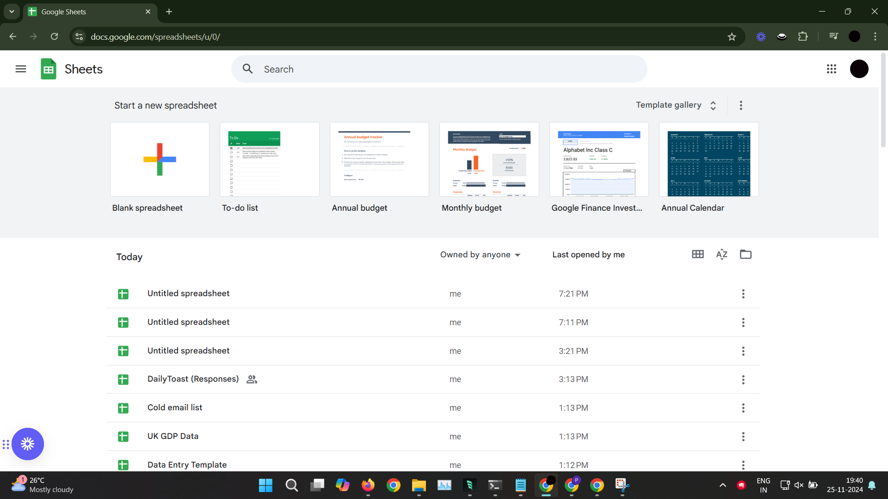
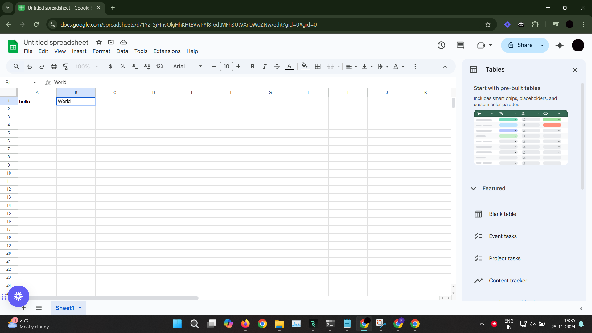

# Computer Use Demo - Step by Step Guide

This guide walks you through the process of using the Computer Use Demo, which demonstrates an AI agent's ability to interact with your computer interface.

## Setup and Installation

1. Make sure you have Python installed on your system
2. Install the required dependencies:
   ```bash
   pip install -r requirements.txt
   ```

## AWS Bedrock Setup

1. Configure your AWS credentials:
   ```bash
   aws configure
   ```
   When prompted, enter:
   - Your AWS Access Key ID
   - Your AWS Secret Access Key
   - Default region name
   - Default output format

2. Set your AWS profile:
   ```bash
   export AWS_PROFILE=default
   ```

3. Grant Accessibility Permissions (MacOS):
   - The script uses `pyautogui` to control mouse and keyboard events
   - Go to **System Preferences** > **Security & Privacy** > **Privacy** tab
   - Select **Accessibility** from the list on the left
   - Add your terminal application or Python interpreter to the list of allowed apps
   - Note: Permission popups should appear automatically on first run

## Running the Application

1. Start the Streamlit application:
   ```bash
   streamlit run run_with_streamlit.py
   ```

2. The application will open in your default web browser, showing the following interface:
   - Left panel: Main interaction area
   - Right panel: Screenshot upload section
   - Sidebar: Configuration options

## Using the Application

### 1. Configuration (Sidebar)
- Select the AI model (default: claude-3-sonnet)
- Choose the provider (default: BEDROCK)
- Customize the system prompt if needed
- Edit instructions in the instructions editor

### 2. Adding Instructions
- Instructions can be added in two ways:
  1. Through the sidebar's instruction editor
  2. By editing the `instructions.txt` file directly
- Each instruction should be on a new line
- Example instructions:
  ```
  Open Safari
  Go to Google Spreadsheets
  Create a new spreadsheet with two columns
  ```
  Click on the "Save Instructions" button to save changes

### 3. Executing Instructions

#### Automatic Execution
1. Click "Execute All Steps" to run all instructions sequentially
2. The agent will:
   - Take screenshots to understand the current state
   - Execute necessary actions (mouse movements, keyboard inputs)
   - Provide feedback through the conversation history

#### Manual Control
- Use "Stop" to interrupt the execution
- Use "Clear Conversation" to reset the chat history
- Use "Reset All" to start over completely

### 4. Screenshot Integration
- The right panel allows you to upload screenshots
- Click "📸 Click a screenshot to continue" to upload an image
- The agent will analyze the screenshot and continue its tasks accordingly

## Example Workflow

Here's a sample workflow demonstrating the agent creating a Google Spreadsheet:

1. Initial Setup
   
   - Agent opens Safari

2. Navigation
   .png)
   - Agent navigates to Google Sheets

3. Creating Spreadsheet
   .png)
   - Agent creates a new spreadsheet

4. Adding Content
   .png)
   - Agent adds column headers

5. Final Result
   .png)
   - Completed spreadsheet with columns

## Understanding the Output

The conversation history shows different types of messages:
- 🤖 Assistant: AI's planned actions
- 💻 System: System-level operations
- 🔧 Tool Output: Specific actions performed

Example output sequence:
```
💻 System: I'll help you take a screenshot and then open Safari...
💻 System: Now, let's open Safari using the bash command:
🔧 Tool Output: Mouse moved successfully to X=623, Y=55
🔧 Tool Output: Left click performed.
```

## Troubleshooting

1. If the agent seems stuck:
   - Use the "Stop" button to interrupt the current execution
   - Clear the conversation and try again with more specific instructions
   - Ensure the instructions are clear and actionable

2. Common considerations:
   - Mouse coordination: The agent will adjust based on screen feedback
   - Browser navigation: The agent uses visual cues to navigate
   - Screen resolution: The agent adapts to your screen layout

## Tips for Best Results

1. Write clear, specific instructions
2. Allow the agent to complete its current task before interrupting
3. Use the screenshot feature when the agent needs visual context
4. Monitor the conversation history for detailed feedback
5. Use "Stop" if you need to interrupt a sequence of actions

## Windows Example Workflow

Here's a sample workflow demonstrating the agent performing tasks on Windows:

1. Initial Desktop
   

2. Opening Applications
   

3. Performing Operations
   

4. Browser Interaction
   

5. Spreadsheet Tasks
   

Note: The actual appearance may vary depending on your Windows version and theme settings.

### Windows-Specific Tips

1. Screen Resolution:
   - The agent adapts to your Windows display settings
   - Works with both single and multi-monitor setups

2. Application Access:
   - Ensure applications are accessible via Start menu or desktop
   - Keep frequently used applications pinned to taskbar for easier access

3. Browser Compatibility:
   - Works with Chrome, Edge, and other browsers
   - Browser should be updated to latest version for best results

4. Windows Permissions:
   - Allow Python/Terminal through Windows Defender if prompted
   - Grant necessary permissions for screen capture and input control